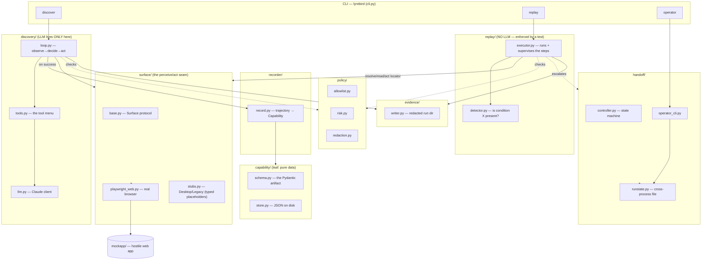
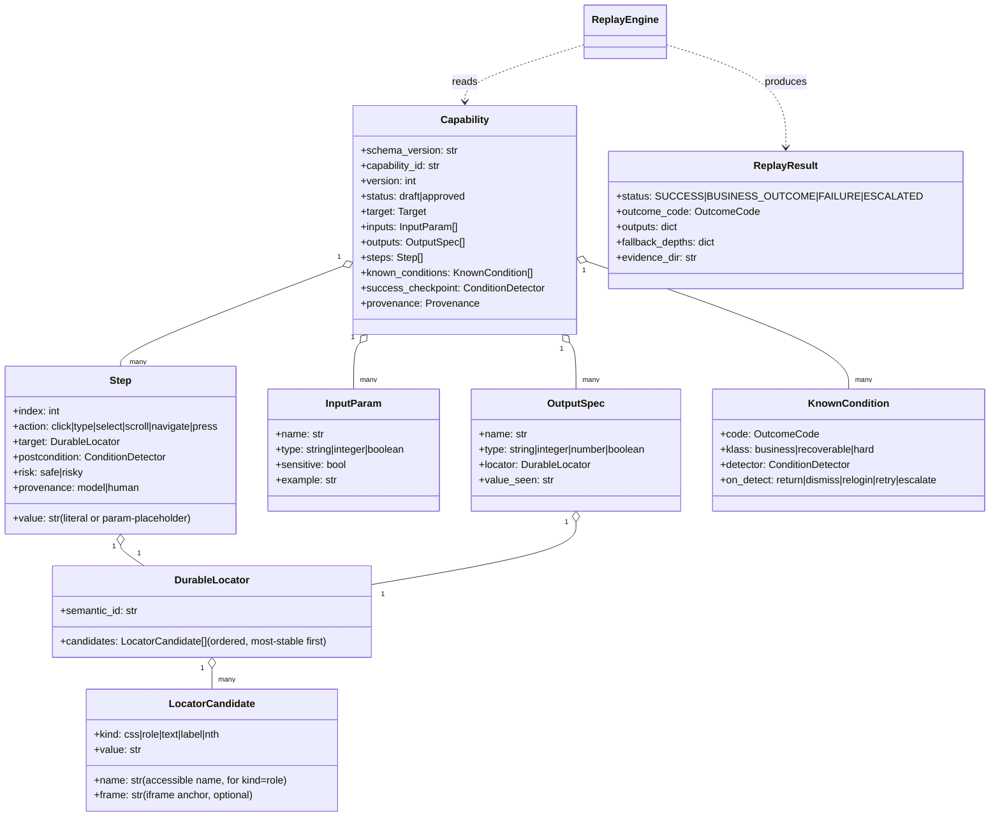
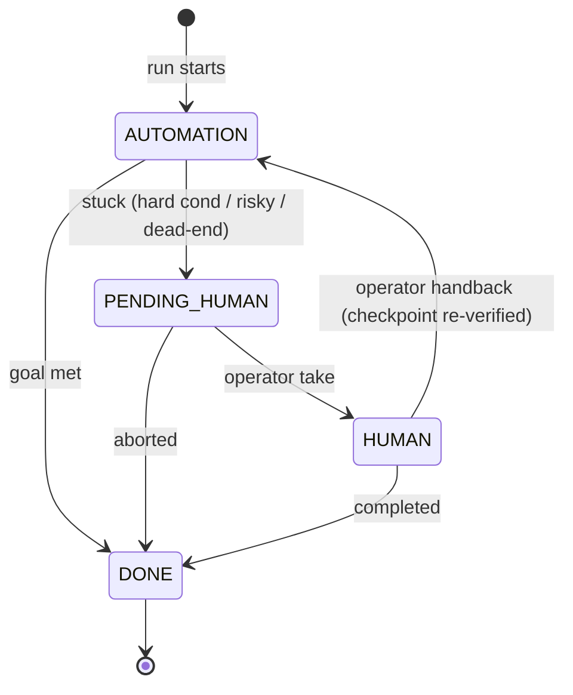

# lyrebird — How It Actually Works (a detailed, from-basics walkthrough)

This document explains **what is implemented in the code right now** — not what was
planned. It's written to teach: every technology, term, and design choice is explained from
basics, with pointers to the exact files. Read it top to bottom and you'll understand the
whole system.

> **The design in four ideas, each detailed below:**
> 1. **Interactive NL entry point** — you give a goal + URL in plain English; the agent
>    *infers* the typed input/output contract from the goal and confirms it (Sections 5 and 5a). No
>    per-site scripts.
> 2. **Discovery verifies each action** — after acting, the agent re-observes and confirms the
>    action did what it intended before recording the step, capturing a *verified postcondition*
>    (Section 5).
> 3. **Durable locators, the LLM's judgment** — for every element the LLM points at, we capture
>    the node's own stable handles (id / name / data-\* / role+name / text / label anchor). At
>    `read_value` the LLM judges whether an output value is *variable* or *fixed* and, if
>    variable, which stable **label** anchors it — so replay re-reads it even when the value
>    itself changes, with no per-site rules and no data-type guessing (Sections 4.2 and 7.3).
> 4. **Replay is agent-*supervised*** — deterministic on the happy path (zero LLM), it checks
>    each recorded postcondition; a genuine deviation escalates to a **human**, and the LLM's
>    only role in production is a *diagnostic text* for that human — it never decides or acts
>    (Sections 8 and 8a).

---

## 0. The one-sentence idea, unpacked

> An LLM **discovers** how to do a task in a UI once; that success is frozen into a typed,
> versioned **artifact**; and a separate, LLM-free engine **replays** that artifact
> deterministically forever after.

Why this shape? Because driving a UI with an LLM is **slow, expensive, and
non-deterministic** (the model might do it slightly differently each time). You don't want
that in production every time you look up an account balance. So you pay the LLM cost
**once** to figure out the flow, capture it as data, and then run it **cheaply and the same
way every time** with plain code. That "capture it as data" step is the heart of the system.

Three vocabulary words you need up front:

- **LLM** (Large Language Model): the AI (here, Anthropic's Claude) that can look at a
  screenshot + a list of on-screen things and decide "click this, type that." It has
  *judgment* but is non-deterministic and costs money per call.
- **Deterministic**: same input → same steps → same output, every time. Plain code is
  deterministic; an LLM is not. Replay must be deterministic.
- **Artifact** (we call it a **Capability**): a structured file (JSON) describing the flow —
  the steps, how to find each element, what inputs it needs, what outputs it returns. It is
  the *contract* between the "discover" world and the "replay" world.

---

## 1. The technology stack, and why each piece

| Layer | Technology | What it is (from basics) | Why it's used here |
|---|---|---|---|
| Language | **Python 3.12** | A high-level programming language. | Fast to build in; has the two libraries below that do most of the heavy lifting. |
| Data models | **Pydantic v2** | A library that turns Python classes into *validated, typed data schemas* — it checks types at runtime and can export/import JSON automatically. | The artifact **is** a Pydantic model. We get validation, JSON serialization, and JSON-Schema export for free. If a field is the wrong type, it fails loudly instead of silently. |
| Browser control | **Playwright** | A library that drives a real Chrome browser programmatically — click, type, navigate, screenshot, run JavaScript inside the page. | This is how we "operate the UI like a human." It handles the messy reality of iframes, forms, navigation. |
| The AI | **Anthropic Claude** (`claude-sonnet-4-6`) via **tool use** | The LLM. "Tool use" means we give the model a menu of functions it may call (click, type, …) and it responds by *choosing a function and its arguments* rather than free text. | Turns "look at this screen and decide" into a structured, machine-parseable decision. |
| Web app under test | **FastAPI + Jinja2** | FastAPI is a Python web-server framework; Jinja2 renders HTML templates. | We built our own deliberately "hostile" bank app (`mockapp/`) to test against — full control, no real data, and we can inject failures on demand. |
| Tests | **pytest** | The standard Python testing framework. | Everything except the one discovery run is tested *with no LLM*, so tests are fast and deterministic. |
| Packaging | **uv** | A fast Python package/dependency manager. | `uv run …` sets up the environment and runs commands. |

**Key term — "tool use" (a.k.a. function calling):** instead of the LLM replying with a
paragraph, we hand it a list of tools like `click(index)`, `type(index, param)`,
`read_value(index, output)`. The model replies with a structured object: *"I want to call
`click` with `index=5`."* Our code executes that and feeds the result back. This is what
makes an LLM able to *act*, not just talk. See `src/lyrebird/discovery/tools.py`.

---

## 2. Architecture diagram (what talks to what)



**How to read this:** the CLI is the front door with three verbs. `discover` drives the LLM
loop; `replay` drives the deterministic engine; `operator` is the human-handoff console.
Everything funnels through the **`surface/`** layer to touch the browser, and through
**`policy/`** for safety. The **`capability/`** artifact is the bridge: `discover` writes it,
`replay` reads it.

**The two most important boundaries (why the code is split this way):**

1. **`surface/` is the "perceive/act seam."** Nothing above it knows it's a browser. It
   speaks only in generic terms — *role, name, value, durable locators* — and it owns locator
   *resolution*, so only `playwright_web.py` knows the word "DOM." This is what would let you add
   a desktop-app surface later without touching discovery/replay. (More in Section 9.)
2. **`replay/` never imports the LLM.** This is enforced by an actual test
   (`tests/test_no_llm_in_replay.py`) that imports the replay package in a fresh process and
   asserts the Anthropic library was never loaded. If someone accidentally couples them, CI
   goes red. This is the structural guarantee that "replay is LLM-free" is *true*, not just
   claimed.

---

## 3. The mock app — the thing we drive (`mockapp/`)

Before the interesting parts, understand the target. `mockapp/app.py` is a small FastAPI
web app pretending to be a credit-union teller console. It is **intentionally hostile**,
meaning its HTML is built like a bad legacy enterprise app on purpose:

- **No `id` and no `data-testid` attributes.** In normal web automation you'd grab an
  element by a stable id (`document.getElementById("balance")`). Legacy bank apps don't have
  those. We forbid them so our system is forced to find things the *hard* way — the way it'd
  have to in reality.
- **Table-based layout** (`<table>` for structure, not modern CSS), **inline event handlers**
  (`onclick="..."` in the HTML), generic class names (`c1`, `col`), and labels that relate to
  inputs only by being *in the next table cell* — not by a proper `<label for=…>`.
- An **iframe** (a page embedded inside another page) holding the account balance. Iframes
  are notoriously annoying for automation because they're a separate document; we include one
  deliberately.

It also has **injectable failure conditions** via a `?inject=` URL parameter
(`mockapp/conditions.py`): `not_found`, `permission_denied`, `validation_error`,
`interstitial` (a popup), `session_expiry`, `slow_load`, `http_500`, `unknown_dialog`. This
is how we test that replay handles real-world runtime problems — we can *summon* each problem
on demand, which you can't do against a real site.

**Term — DOM (Document Object Model):** the browser's live, in-memory tree of the page's
elements. "Clean DOM" = elements have meaningful, stable identifiers. "No clean DOM" = the
legacy reality we're simulating.

---

## 4. The Surface — how we perceive and act (`surface/`)

This is the layer that turns "a live web page" into something the rest of the system can
reason about generically.

### 4.1 The vocabulary (`surface/base.py`)

Everything is described with these Pydantic models (simplified):

- **`Element`** — one thing on screen: `role` (e.g. `"button"`, `"textbox"`, `"text"`),
  `name` (its accessible label/text), `value` (current contents), `bbox` (its x/y/width/height
  pixel box), `container_path` (which frame it's in), `nearby_text` (text of the surrounding
  table row/cell), `index` (its position in the current list — a *temporary handle*), and
  **`locators`** — the durable handles read straight off this DOM node (id / name / data-\* /
  role+name / text / label anchor), most-stable first. These are what replay uses to re-find it.
- **`Observation`** — one snapshot: the current `url`, a `screenshot` (PNG bytes), the list of
  `elements`, and an `aria_digest` (a hash/fingerprint of the page structure).
- **`Action`** — a thing to do: `kind` (`click`/`type`/`select`/`scroll`/`navigate`/`press`),
  a `target_index`, and a `value`.
- **`Surface`** — a **Protocol** (see below). Discovery uses `observe()` / `act()` /
  `page_text()` / `snapshot()`; replay additionally uses `resolve_locator()` / `read_locator()`
  / `act_locator()`, which resolve a durable locator against the live page (no element index).

**Term — Protocol (structural typing):** in Python, a `Protocol` defines a *shape* — "any
object with these methods counts as a Surface." You don't have to inherit from it. This lets
`PlaywrightWebSurface`, `DesktopSurface`, and `LegacyWebSurface` all *be* Surfaces just by
having the right methods. It's the seam that makes the system extensible.

**Term — ARIA / accessibility tree / role & name:** ARIA is the web standard that screen
readers use. Every element has a *role* ("button", "textbox") and an *accessible name*. These
are more stable and meaningful than raw HTML tags, and — importantly — **desktop apps expose
the same concept** through their OS accessibility APIs. By describing elements in role+name
terms, our artifact isn't web-specific.

### 4.2 The real implementation (`surface/playwright_web.py`)

`observe()` does something clever. It injects a **JavaScript function into the page** (via
Playwright's `evaluate`) that walks the DOM and returns a compact list of:

1. **Interactables** — links, buttons, inputs, selects, anything with a role or an `onclick`.
2. **Value-bearing text cells** — table cells (`<td>`/`<th>`) that contain a number/currency
   and aren't themselves clickable. *This is why the system can now "read the balance" as a
   first-class element* (see Section 7.3). Each such cell gets role `"text"`.

For **iframes**, it runs that same JavaScript in *every* frame and **flattens** them into one
list, tagging each element with a `container_path` like `["frame:workspace"]`. So the rest of
the system sees one flat list of elements and never has to know an iframe existed. (A desktop
app's nested windows would flatten the same way — that's the point.)

It also stamps each element with a hidden attribute `data-lb-idx="N"`. During discovery, when
it's time to `act()`, the code re-selects the exact element by that attribute. This is an
**internal handle**, valid only for the current observation — it is *never stored in the artifact*.

**Durable locators — the key to deterministic replay.** For every element, the same JavaScript
also reads that node's own stable handles and returns them ordered most-stable-first:
`#id` → `[name="…"]` → a stable `data-testid`/`data-qa` attribute → ARIA role + accessible name
→ exact visible text → and, for a value cell, a **`label`** candidate (the previous cell's text,
e.g. "Savings") → a last-resort tag ordinal (`td@4`). We deliberately do **not** emit brittle
class chains. These are concrete handles the node *actually has*, so replay can re-find the same
node with a real Playwright locator (`page.locator("#id")`, `get_by_role(...)`, `get_by_text(...)`).
The surface just *reports* every handle a node has; it doesn't decide which one matters — the LLM
does that at `read_value` (Section 7.3). This is why a stable-DOM legacy app replays reliably.

**Set-of-Marks (SoM):** the technique of numbering interactable elements and giving the LLM a
screenshot plus a list like `[5] button 'Sign in'`. The model picks a *number*; we map it
back to the element. It's how a vision LLM can point at things precisely.

---

## 5. The discovery loop — the LLM's turn (`discovery/`)

This is the only place the LLM runs. Here's the actual loop from `discovery/loop.py`:

```mermaid
sequenceDiagram
    participant U as CLI (discover)
    participant L as DiscoveryLoop
    participant S as Surface (Playwright)
    participant P as Policy
    participant C as Claude (LLM)
    participant E as EvidenceWriter

    U->>L: run(goal, inferred contract)
    L->>S: observe()  (screenshot + element list)
    S-->>L: Observation
    L->>E: save screenshot + ARIA (redacted)
    loop until finish / max steps / dead-end
        L->>C: decide(system, messages, tools)  [forced to pick a tool]
        C-->>L: ToolCall (e.g. type param=member_id, expect_text=...)
        alt acting tool (click/type/select/...)
            L->>P: check_action(url, action_type)   [allowlist]
            P-->>L: allow / deny
            note over L: deny → escalate & stop
            L->>S: act(Action)
            L->>S: observe()  (auto re-observe after every action)
            note over L: VERIFY: is expect_text present? record it as postcondition (else tell model to retry)
        else read_value(output, index, value_seen, value_stability, anchor_label)
            note over L: record the element's durable locators; anchor variable values on a label
        else finish(success, outputs)
            L->>E: write result + trajectory
        end
    end
    L-->>U: DiscoveryResult (SUCCESS + evidence dir)
```

Walking through the important mechanics:

- **`decide()` with forced tool choice.** We call Claude with `tool_choice="any"`, meaning
  the model *must* pick one of our tools every turn (it can't just chat). The tools are
  `observe`, `click`, `type`, `select`, `scroll`, `navigate`, `press`, `read_value`, `finish`
  (`discovery/tools.py`).
- **Vision each turn.** After *every* action, the loop automatically re-observes and sends the
  new screenshot + element list back to the model (`_append_observation`). This was a real bug
  fix: without it, the model acts blindly and repeats itself. Now it *sees the effect* of each
  action, like a person glancing at the screen after each click.
- **Parameter binding — the crucial trick** (`_resolve_param`): when the LLM types into the
  member-ID field, it doesn't type a literal. It calls `type(index, param="member_id")`. The
  loop looks up `member_id`'s *example value* and types that into the browser, but **records
  the step as `{{member_id}}`** — a placeholder. So the recorded flow says "type the member_id
  parameter here," not "type 100001 here." That's what makes replay reusable with *different*
  member IDs. **Sensitive** params (like a password) are read from env at discovery and from a
  local `secrets.yaml` at replay, so the real secret is never written into the artifact or logs.
- **Verify-via-re-observation (the closed loop).** When the model acts, it also states an
  `expect_text` — a short, distinctive string it expects to see afterward. After the action the
  loop checks that text against the fresh page; a match is recorded as the step's **verified
  postcondition** (so replay can later confirm the same thing), and a *miss* is told back to the
  model ("expected X but it didn't appear — the action may not have worked") so it can retry
  instead of recording a step that didn't achieve its intent. This is the model *verifying its
  own work* — the fix for silently recording a broken step.
- **`read_value` — the LLM's judgment about each output** (see Section 7.3): before finishing, the model
  points at the value's element by `index`, reports the **value it sees** (ground truth), and — the
  part only it can judge — says whether the value is **variable** (changes with the inputs, like a
  balance) or **fixed**, and if variable, which stable **`anchor_label`** the value sits next to
  (e.g. "Savings"). For a value inside a per-run iframe it also gives a `frame_anchor` (a stable
  URL substring). The loop takes that element's durable locators and, for a variable value, puts
  the `label` candidate first — so replay re-reads by the label, never by the value that will
  differ next run. Our code never guesses data types; the model decides.
- **Stop conditions:** `finish(success=true)`; **max steps** (a budget so it can't loop
  forever); a **dead-end guard** that detects the model repeating the identical action and stops
  (escalating to a human — Section 11); and, when the LLM is genuinely stuck, a **human-teach handoff**
  where a person performs the step on the same live session and their moves are captured as
  re-resolvable steps stamped `provenance: human` (Section 9). There's also an auto-finish if the model
  keeps re-reading an already-captured output.
- **Every step is logged, redacted, to an evidence directory** (`evidence/writer.py`) —
  screenshots (with sensitive fields masked), the element list, and a JSONL trace of decisions.

The output of a successful discovery run is a **trajectory** (the ordered list of what
happened) plus that evidence. The trajectory is the raw material for the recorder.

### 5a. The interactive natural-language entry point (`discovery/interactive.py`, `contract.py`)

You don't hand-write a script per site. `lyrebird discover` asks three things in plain English:

1. **Goal** — e.g. *"Log in and find the balance of account 13344."*
2. **Target URL** — checked against the file-based allowlist (`policy.yaml`) **before** any
   browser launches; if it's not allowed, the run is refused (fail-closed).
3. **Credentials** — *"Do you already have a username and password?"* If yes, they're collected
   without echo (via `getpass`) and handled as sensitive params (password never stored). If no,
   the agent proceeds and falls back to the **human-teach handoff** if it hits a login it can't do
   (Section 11). For a non-interactive run (no TTY), `scripts/discover_mock.py` drives the same loop with
   credentials from `.env` — that's what produces the committed evidence.

From the goal alone, one cheap LLM call (`contract.py`) **infers the typed contract** — which
values are per-invocation *inputs* (the account id) and which are *outputs* (the balance) —
excluding credentials. The inferred contract is **shown back to you to confirm** (*"Recording:
input `account_id`, output `balance` — correct?"*) before discovery runs. That confirmation is
both a human review point (the artifact must be *reviewable*) and the safeguard against
mistaking a constant for a parameter. This is the whole reason the system generalizes without
per-site code: the model reads the goal and figures out the contract; we don't hard-code it.

---

## 6. The recorder — trajectory → Capability (`recorder/record.py`)

The recorder is **pure, deterministic code** (no LLM). It reads the saved trajectory and
turns each step into a typed `Step` in a `Capability`. The interesting work is **assembling the
durable locator** for each element.

**Term — locator:** a description of *how to find an element again later*. A brittle locator
is "the 5th element" or "the element at pixel (92,176)". A durable locator is a concrete handle
the node actually has — `#account-id`, `[name="q"]`, an ARIA role+name, exact text. The Surface
already captured these off each node during `observe()` (Section 4.2); the recorder just wraps them into
a `DurableLocator` (an ordered `candidates` list) per step target, verbatim. There's no
locator-*synthesis* heuristic here anymore — the node reported its own handles.

**Why a *list* and not one locator?** Because at replay time the surface tries them in order and
uses the first that yields exactly one match. Which candidate wins tells us how much the page has
*drifted* from when it was recorded — the "fallback depth" is a built-in drift signal (Section 7.2).

**Output locators carry the LLM's judgment.** For each `read_value`, the recorder builds the
output's `DurableLocator` from the trajectory: for a **variable** value it leads with the
`label` candidate the LLM chose (`anchor_label`) — because a balance's own text changes per run —
optionally stamped with the LLM's `frame_anchor` so a per-member iframe still matches; for a
**fixed** value it keeps the node's own handles. Our code makes no variable-vs-fixed decision;
it records the model's.

**Parameter binding round-trips here too:** if the LLM typed a literal that happens to equal a
known example value, the recorder binds it to that parameter but **flags it "inferred"** for a
human to confirm — it never silently guesses. The result is saved by `capability/store.py` as
versioned JSON: `artifacts/<capability_id>/v1.json`.

---

## 7. The Capability artifact — the contract (`capability/schema.py`)

This is the most important data structure in the system. It's a Pydantic model, so it's
typed and self-validating. Top-level fields:

- `schema_version`, `capability_id`, `name`, `version`, `status` (`draft`/`approved`) — a
  capability is **versioned** and has an approval state (risky flows are blocked unless
  `approved`).
- `target` — which app/vendor/tenant this belongs to (the hook for multi-tenant reuse).
- `inputs` — typed parameters, each with a `sensitive` flag. (A validator forbids a sensitive
  input from carrying an example value — so secrets can't leak into the artifact.)
- `outputs` — typed things to extract, each with a `DurableLocator` (how replay re-finds the
  element to read) and the `value_seen` the LLM observed (a ground-truth sanity check).
- `steps` — the ordered actions; each has an `action`, a `target` (a `DurableLocator`), a `value`
  (literal or `{{param}}`), pre/post-conditions, a `risk` flag, and `provenance`
  (`model`/`human`).
- `known_conditions` — the runtime problems this flow knows how to recognize and what class
  each is (see the taxonomy below).
- `success_checkpoint` — how to confirm we actually reached the goal.
- `provenance` — which discovery run/model produced it, when, and the viewport size (so `bbox`
  is interpretable). **The raw LLM transcript is deliberately NOT included** — the artifact is
  decoupled from it.

### 7.1 The error taxonomy (why "not found" isn't a crash)

A first-class idea, encoded as enums (`OutcomeClass`, `OutcomeCode`):

- **Business outcome** — a *legitimate answer*, not a failure. "No such member",
  "permission denied", "validation error." The caller needs to know these, but they are **not
  crashes**. Conflating "no such member" with "the automation broke" is the single most common
  mistake in this kind of system; the taxonomy makes them distinct types.
- **Recoverable** — a hiccup we can handle and continue: dismiss a popup (`interstitial`),
  wait out a slow load, log back in after a session expiry, retry a transient 500.
- **Hard** — genuine failure: an unknown dialog, an element we can't find, a checkpoint that
  fails. These stop the run (and can escalate to a human).

### 7.2 Class diagram (the schema and how the engines use it)



### 7.3 The output-extraction story (a real bug, and the fix — worth understanding)

This is the best example of the design working. Early on, replay read outputs (like the
balance) with a text regex: "find `Balance` then grab the next `$number`." That assumed a
layout. Later attempts piled on more machinery — a grammar of finders, then a menu of data-type
"shapes" (currency/number/text), then an LLM-authored extraction *expression* evaluated in a
sandbox. Each one was **our code trying to encode what the app means** — and each broke on the
next case or, worse, silently read the wrong value.

The real lesson: **don't reconstruct the value from text — anchor on structure, and let the LLM
decide.** The value that breaks everything is a *variable* one (a balance, a total) whose own
text changes every run, so it can never be its own locator. What *is* stable is the value's
**label**. So two things carry the load:

1. The Surface reports, for a value cell, a `label` candidate (the previous cell's text, e.g.
   "Savings") among its durable handles — it just makes the option available.
2. At `read_value` the **LLM decides**: this value is *variable*, and it's anchored on *Savings*.
   The recorder puts `label:Savings` first in the output's `DurableLocator`.

At replay the Surface resolves that with a real Playwright locator — "the cell in the row whose
label cell says 'Savings'" — reads its text, and casts to the output's declared type. The exact
same recorded recipe reads member 100001's `$4,210.75` and member 100003's `$15,320.00`: the
value differs, the locator doesn't. No data-type logic in our code, no per-site edits — the model
owns the judgment, our code owns the deterministic mechanism. (A related subtlety: a
*postcondition* or an iframe URL that mentioned a bound input's discovery-time value — e.g.
"Member 100001" — is **parameterized** to `{{member_id}}` so it holds on replay with a different
member; the recorder substitutes, the executor substitutes the live value back.)

---

## 8. The replay engine — agent-*supervised*, deterministic (`replay/`)

This is the production path: given an artifact + fresh inputs, do the flow. The **decision loop
is LLM-free** — the agent *supervises* deterministically. On the happy path and for all known
conditions, **zero LLM calls**. The model reappears only to write a *diagnostic for a human* on
a genuine deviation (Section 8a) — it never decides or acts.

```mermaid
sequenceDiagram
    participant U as CLI (replay)
    participant R as ReplayEngine (supervisor)
    participant S as Surface (resolves durable locators)
    participant D as Detector
    participant H as Human (operator)

    U->>R: run(capability, params, secrets)
    loop each Step in the artifact
        R->>R: classify_risk(step)  → risky + not(approved&confirm) → ESCALATE (never submits)
        R->>R: policy-check + substitute param-placeholders (secrets from secrets.yaml)
        R->>S: act_locator(step.target)  (first candidate that matches uniquely, else LOCATOR_NOT_FOUND)
        R->>S: observe()
        R->>D: recorded postcondition met?  (deterministic, NO LLM)
        alt met
            note over R: continue
        else known condition (taxonomy)
            note over R: business → return · recoverable → recover & retry · hard → fail
        else genuine DEVIATION
            R->>H: escalate + LLM diagnostic TEXT (never acted on); log for offline update
        end
    end
    R->>D: success_checkpoint present?  (deterministic)
    R->>S: read_locator(each output's DurableLocator) → read text → cast to declared type
    R-->>U: ReplayResult(SUCCESS, outputs, fallback_depths)
```

The three sub-parts:

- **Surface locator resolution — the determinism core** (`surface/playwright_web.py`:
  `resolve_locator` / `read_locator` / `act_locator`). For a `DurableLocator`, the surface tries
  each candidate as a real Playwright locator in order; the first that resolves to **exactly one**
  element wins, and its position is the **fallback depth**. Zero or many matches → try the next
  candidate. If nothing resolves uniquely → `LOCATOR_NOT_FOUND` (hard). A value in a per-run iframe
  is matched by the LLM's stable `frame_anchor` substring, so `.../member/100003` resolves via
  `workspace/member`. **This is the key safety property:** replay either finds *the* element
  unambiguously or fails loudly — it never clicks a guess. Keeping resolution *in the surface*
  also keeps the whole `replay/` package free of any browser/DOM import — the seam is clean.
- **Detector (`detector.py`).** Answers "is condition X present?" three ways: `text`
  (substring of the page text), `role` (an element of that role exists), or `url_pattern` (the
  URL matches). Used for known-condition detection, checkpoints, and pre/post-conditions.
- **Executor (`executor.py`) — the supervisor.** Runs each step: risk-gate → policy-check →
  substitute params → `act_locator` → re-observe → **verify the recorded postcondition
  (deterministically, no LLM)**. If the postcondition holds, continue. If it fails, check the
  taxonomy (`known_conditions`): a business outcome is returned, a recoverable one is handled
  *and the step re-attempted* (a dismissed popup is only useful if you then redo what you were
  doing), a hard one fails. If the postcondition fails and **no** known condition explains it,
  that's a **deviation** → Section 8a. After all steps: verify the success checkpoint, then read each
  output via its `DurableLocator` and cast to the declared type. Produces a `ReplayResult`.

**Determinism techniques worth naming:**

- **Condition-based waiting, not sleeps.** Instead of "wait 2 seconds," it waits for the page
  to reach network-idle / the expected condition. Sleeps are flaky; condition waits are
  deterministic.
- **Real handles, not coordinates.** Replay resolves nodes by their own id/name/role/text/label,
  never by pixel position or element index — those point at a different element the moment the
  layout shifts.
- **Fallback depth as drift telemetry.** If a step used to resolve at candidate 0 and now
  resolves at candidate 3, the UI shifted. We record this without failing — it's an early
  warning, and the hook a "should I re-record this capability?" score would build on.

### 8a. Deviation → diagnostic → human (`handoff/diagnostic.py`) — and why replay stays LLM-free

A **deviation** is the case the supervisor can't explain: a step's verified postcondition
failed *and* no `known_condition` matches. Here — and only here — production touches the LLM,
in a strictly bounded way (`make_deviation_handler`):

1. The LLM produces a short **diagnostic text**: "expected X, observed Y, likely cause…". It is
   given no tools and returns a string.
2. The engine **escalates to a human** (`SessionController`, Section 9): writes an intervention request
   with the diagnostic, flips the run state to `PENDING_HUMAN`.
3. The deviation is **logged for offline artifact update** — we never self-modify a deterministic
   capability live; a human reviews and re-records later. (Building that review pipeline is a
   documented cut.)

**The invariant this preserves:** the LLM's output here is a *message to a human*, never an
action. It is passed to the evidence writer and the operator, never to `surface.act()`. A test
(`tests/test_deviation_handoff.py`) asserts exactly that — the diagnostic string never appears
in any action argument. So replay's *decision loop* is always deterministic-or-human; the model
only helps a person read the situation. This is the honest form of "replay without the LLM in
the decision loop": the happy path and every known condition make **zero** LLM calls, and the
one production LLM use decides nothing.

---

## 9. Heterogeneity & multi-tenant (designed, not fully built)

- **Surface abstraction.** Because everything above `surface/` is browser-free, adding a
  desktop or legacy surface means writing one new class that implements the `Surface`
  protocol. `stubs.py` contains `DesktopSurface` and `LegacyWebSurface` that satisfy the
  protocol (they type-check) but raise `NotImplementedError` — proving the seam is real
  without building them. Crucially, **no locator strategy in the artifact uses anything a
  desktop accessibility API couldn't also answer** (that's why CSS/XPath are banned from the
  schema — they're web-only).
- **Multi-tenant reuse.** Steps reference elements by a stable `semantic_id`. A second tenant
  running the same vendor app would be handled by an *override table* keyed on that
  `semantic_id`, not by re-recording. The drift telemetry (fallback depth) is what would flag
  when a tenant has diverged enough to need an override. The design is in place; the override
  layer itself is a documented cut.

---

## 10. Safety (`policy/`)

Three pure functions, checked before every action in *both* loops, all **fail-closed**
(anything not explicitly allowed is denied):

- **`check_action` (allowlist).** Is this URL's domain allowed? Does the path match an
  allowed pattern? Is this action type permitted? A missing/empty URL is denied; a missing
  policy file raises. `navigate` is checked against the *destination* URL, not the current
  page (a real bug we fixed — otherwise a jump to a bad domain would slip through).
- **`classify_risk`.** Flags actions whose target text matches risky patterns
  (submit/confirm/transfer/delete). A **risky step is blocked in unattended replay unless the
  artifact is `approved` AND the caller passes `confirm_risky=true`** — otherwise it
  escalates, and (proven by test) *never submits*. The bias is deliberate: a false "risky"
  just asks a human; a false "safe" could move money.
- **Redaction (`redact_text`, `mask_screenshot`).** Sensitive values are referenced by name and
  read at run time from outside the artifact (env at discovery, a gitignored `secrets.yaml` at
  replay); a scrubber removes SSN/account-number patterns and any named secret from all text
  evidence; screenshots have sensitive-field boxes painted over. **Redaction runs on the write
  path**, so no unredacted value ever reaches disk — verified by an end-to-end audit test over all
  committed evidence.

---

## 11. Human handoff (`handoff/`) — pausing and giving a human the wheel

Sometimes automation must stop and let a person finish (a hard condition, a risky step). The
requirement is that the human operates **the same live browser session**, not a fresh one,
and that control transfer is *real*.

- **The control channel is a file, not a memory lock.** Because the operator console runs as a
  *separate process*, the two can only communicate through something both can see: a
  `run_state.json` file in the run's evidence dir (`runstate.py`). The engine **polls** this
  file; the operator **writes** it. So "who is in control" is always answerable by reading one
  file.
- **State machine (`controller.py`):** `AUTOMATION → PENDING_HUMAN → HUMAN → AUTOMATION →
  DONE`, with a guard that rejects illegal transitions. On a stuck trigger the engine writes an
  `intervention_request.json` (what capability, which step, the URL, why, a screenshot), flips
  to `PENDING_HUMAN`, and polls until an operator hands back — then **re-verifies a checkpoint
  before resuming** (if the human didn't reach the expected state, it goes back to
  `PENDING_HUMAN` rather than blindly continuing).
- **Operator console (`operator_cli.py`):** `lyrebird operator list / take / handback` — a
  separate process that reads/writes those same files.
- **Human-action capture that survives navigation (`capture.py`):** while the human drives, we
  record their clicks/typing to `human_actions.jsonl` (redacted), each as a **full element
  descriptor** (role/name/nearby/bbox). Naive page-injected JavaScript is wiped on every
  navigation, so we combine three Playwright mechanisms — `expose_binding` (a stable callback),
  `add_init_script` (re-inject on new documents), and a per-`load` re-injection — so the
  listeners reattach after each navigation.

**One mechanism, two roles.** The same `SessionController` + run-state file + capture serves
both handoff triggers:

| | **Discovery** handoff | **Production (replay)** handoff |
|---|---|---|
| Trigger | the LLM is stuck / can't derive a step | a genuine deviation (Section 8a) |
| Human is the… | **teacher** — performs the step the LLM couldn't | **decision-maker** — resolves the unexpected state |
| What the LLM does | nothing (it gave up) | **diagnostic text only** (Section 8a) |
| What we capture | the human's moves → **re-resolvable steps** stamped `provenance: human`, folded into the artifact (so they replay deterministically later) | the human's moves + the deviation → **logged for offline artifact update** |

Because a captured human move carries a full element descriptor, the recorder builds the **same
semantic locator candidates** for it as for an LLM step (`captured_actions_to_trajectory_rows` →
`record.py`). So a human-taught step is a first-class, replayable step — proven in
`tests/test_human_teach.py`.



---

## 12. Evidence & observability (`evidence/`)

Every run — discovery or replay — writes a directory under `evidence/<run-id>/`:

- `steps.jsonl` — one JSON line per step (what was decided/done, redacted).
- `screenshots/step-NN.png` — per step, sensitive fields masked.
- `aria/step-NN.json` — the element list at that step.
- `result.json` — the final `DiscoveryResult` / `ReplayResult`.
- `run_state.json`, `intervention_request.json`, `human_actions.jsonl` — for handoff runs.

This is what makes a run *debuggable* — you can see exactly what the agent saw and did, and
on failure you have the richer signals (screenshot, element list) to diagnose it.

---

## 13. End-to-end: following one real invocation

Putting it all together, here's the committed happy-path demo, in plain steps:

1. `lyrebird discover` starts a headed Chrome at the mock's login page. The loop screenshots
   it, lists the elements, and sends both to Claude with the goal "log in, look up member
   100001, read the savings balance" and the declared inputs (`username`, `password`
   sensitive, `member_id`) and output (`savings_balance`).
2. Claude calls `type(username_field, param="username")`, then password, then
   `click(Sign in)`. After each, the loop re-observes so Claude sees the next page. It types
   the `member_id` param into search, clicks Search, lands on the detail page whose iframe
   shows the balance.
3. Claude calls `read_value(output="savings_balance", index=…, value_seen="$4,210.75",
   value_stability="variable", anchor_label="Savings", frame_anchor="workspace/member")`, then
   `finish`. The loop records the trajectory + redacted evidence. **This is the only time an LLM ran.**
4. `scripts/build_artifact.py` (the recorder) turns that trajectory into
   `artifacts/lookup_savings_balance/v1.json` — steps with `{{param}}` bindings and durable
   locators, and the balance's output `DurableLocator` led by `label:Savings` (from the LLM's
   variable/anchor judgment).
5. `lyrebird replay lookup_savings_balance --param username="$MOCK_USERNAME" --param member_id=100001`
   runs the artifact with **no LLM** (password from `secrets.yaml`): resolve each element by its
   durable candidates (all at fallback depth 0 = no drift), act, verify the checkpoint, resolve the
   balance by its label anchor and read it → `savings_balance: 4210.75`. Run it again with
   `member_id=100003` and you get *that* member's balance (`15320.0`) — same artifact, same locator,
   different value. That's the whole point.
6. An unknown member (`999999`) returns `BUSINESS_OUTCOME` / `NOT_FOUND` — the recorded
   "No such member" condition fires and it's reported as a legitimate result, not a crash.

---

## 14. Glossary (quick reference)

- **LLM / Claude** — the AI that makes UI decisions during discovery only.
- **Tool use / function calling** — the LLM chooses a structured action from a menu.
- **Set-of-Marks** — numbering on-screen elements so a vision LLM can point at them.
- **DOM** — the browser's element tree. "No clean DOM" = no stable ids (legacy reality).
- **ARIA role/name** — accessibility label of an element; stable and cross-platform.
- **Surface** — the perceive/act abstraction; only it knows it's a browser.
- **Observation / Element / Action** — the generic vocabulary the Surface speaks.
- **Capability / artifact** — the typed, versioned JSON describing a reusable flow.
- **Durable locator / candidate** — how to re-find an element: a ranked list of concrete handles
  (id / name / data-\* / role+name / text / label anchor) read off the node itself.
- **Fallback depth** — which candidate won at replay; a UI-drift signal.
- **Parameter binding / `{{param}}`** — recording "type the member_id here", not a literal.
- **Business outcome vs recoverable vs hard** — the error taxonomy; "not found" is a result.
- **Checkpoint** — an assertion that we actually reached the intended state.
- **Deterministic replay** — running the flow the same way every time, no model involved.
- **Escalation / handoff** — pausing and giving a human control of the same live session.
- **Redaction** — never writing secrets/PII to artifacts, logs, or screenshots.
- **Fail-closed** — when unsure, deny (the safe default for a safety layer).
- **Provenance** — where an artifact/step came from (which model/run, or a human).

---

*Every mechanism above is in the code and covered by tests (113 tests; the 76 non-browser
ones run in ~1 second). The one place an LLM runs is the discovery loop; everything else —
recording, replay, policy, handoff, evidence — is plain, deterministic, tested Python.*
